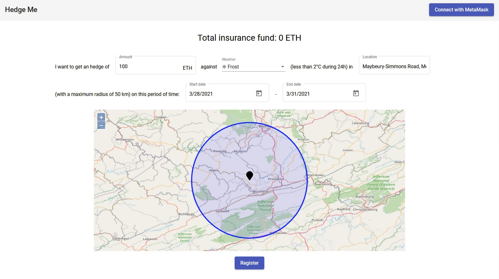

# Hedge Me Now

This is the repository for the HedgeMeNow dapp, created for Chainlink's 2021 Hackathon.  

The deck of the project: https://drive.google.com/file/d/15FbzNV1zLsSo0zBg3kR0dc5ni9HxLooN/view?usp=sharing

  
  
# About

HedgeMeNow is a decentralized insurance as a service.  
Build an insurance smart contract easily, quickly and without third party.  

Get a hedge against risks such as extreme weather and climate conditions, raw material price volatility or political uncertainty.  
The yield obtained from the liquidity pool will be used as compensation for policyholders and as a reward for liquidity providers.  
